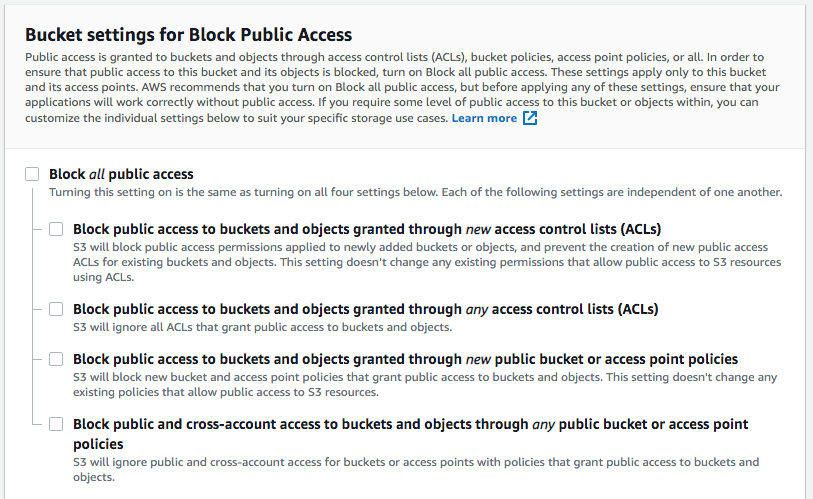

# Lab session #5: Enhancing your web app using additional cloud services

This hands-on session continues the previous lab session where you deployed a basic web app that interacts with students interested in joining your new Cloud Computing course.

For that web app, we used a **DynamoDB table** storing the list of leads, a **Elastic Beanstalk instance** running the Python code that implements the web app functionality.

You had previously set up a **IAM Policy and Role** to grant correct access to the resources involved.

The code used sits in a **private** repository of your GitHub account named `eb-django-express-signup`.

Remember that, in your Elastic beanstalk console, you have the settings of the previously created environment and that you can *unfreeze* the web app by clicking at *Restore terminated environment*.

<p align="center"></p>

### AWS Simple Notification Service (SNS)
We want to know when customers submit a form, therefore we are going to use **AWS Simple Notification Service** (AWS SNS), a message pushing service that can deliver notifications over various protocols. For our web app, we are going to push notifications to an email address.

### AWS CloudFront CDN

A content delivery network or content distribution network (CDN) is a geographically distributed network of proxy servers that disseminate a service spatially, as close to end-users as possible, to provide high availability, low latency, and high performance.

The information that flows every day on the Internet can be classified as "static" and "dynamic" content. The "dynamic" part is the one that changes depending on the user's input. It is distributed by, for instance, PaaS servers with load balancers. The "static" part does not change based on the user's input and it can be moved as close to the end user as possible to improve the "user experience".

Nowadays, CDNs serve a substantial portion of the "static" content of the Internet: text, graphics, scripts, downloadable media files (documents, software products, videos, etc.), live streaming media, on-demand streaming media, social networks and so much more.

Content owners pay CDN operators to deliver the content that they produce to their end users. In turn, a CDN pays ISPs (Internet Service Providers), carriers, and network operators for hosting its servers in their data centers.

**AWS CloudFront CDN** is a global CDN service that securely delivers static content with low latency and high transfer speeds. CloudFront CDN works seamlessly with other AWS services including **AWS Shield** for DDoS mitigation, **AWS S3**, **Elastic Load Balancing** or **AWS EC2** as origins for your applications, and **AWS Lambda** to run custom code close to final viewers.

#  Pre-lab homework

In the previous session, you configured an AWS role `gsg-signup-role` to be used by the EB to run the web app.

When you run the web app locally, if you are using the master account credentials that have been granted access to all resources you might find access problems when deploying the web app later on EB.

To locally run the web app using the `gsg-signup-role` you need to create a new IAM account that will be used for your programs. You can attach several roles to the account either using the console or programmatically as seen below.

```
import boto3

"""
Usage :
    session = role_arn_to_session(
        RoleArn='arn:aws:iam::YOUR-ACCOUNT-ID:role/example-role',
        RoleSessionName='ExampleSessionName')
    client = session.client('sqs')
"""
def role_arn_to_session(**args):
    client = boto3.client('sts')
    response = client.assume_role(**args)
    return boto3.Session(
        aws_access_key_id=response['Credentials']['AccessKeyId'],
        aws_secret_access_key=response['Credentials']['SecretAccessKey'],
        aws_session_token=response['Credentials']['SessionToken'])
```
For this laboratory session we are going to create a new IAM user, with only programmatic access, and we are going to attach the `gsg-signup-policy` using the console. You can explore using the above code for your projects.

1. Open the IAM console [https://console.aws.amazon.com/iam/](https://console.aws.amazon.com/iam/), click on the **"Users"** left menu option and then **"Add user"**. We are going to use "lab_sessions" as "User name", select only Programmatic access and click **"Next:Permissions"**

<p align="center"></p>

2. Select "Attach existing policies directly", search "gsg-.." and select "gsg-signup-policy". Click **"Next: Review"**

<p align="center"></p>

3. Review the data and click **"Create user"**

<p align="center"></p>

4. Copy and save the Access key ID and the secret from the newly created user.

Run `aws configure` and use the new Access Key ID and secret as you did for the [Quickstart](https://github.com/CCBDA-UPC/Cloud-Computing-QuickStart/blob/master/Quick-Start-AWS.md#install-and-configure-aws-cli-and-eb-cli).

When you try to deploy your web app to EB you are going to see that the user has not enough permission to deploy the code and manage Elastic beanstalk. Therefore you need to add four extra policies:

- AWSElasticBeanstalkFullAccess - AWS Managed policy
- AWSElasticBeanstalkService - AWS Managed policy
- AWSCodeDeployRole - AWS Managed policy
- AWSCodeDeployFullAccess - AWS Managed policy

Now test your local programs with the new identity that has much-restricted permissions, as restricted as necessary to interact with the resources used (DynamoDB and SNS) and be able to deploy mand manage the EB to run the web app.

#  Tasks for Lab session #5

* [Task 5.1: Use AWS Simple Notification Service in your web app](#Tasks51)
* [Task 5.2: Create a new option to retrieve the list of leads](#Tasks52)
* [Task 5.3: Improve the web app transfer of information](#Tasks53)
* [Task 5.4: Deliver static content using a Content Delivery Network](#Tasks54)


<a name="Tasks51" />

## Task 5.1: Use AWS Simple Notification Service in your web app


### Create a AWS SNS Topic

Our signup web app wants to notify you each time a user signs up. When the data from the signup form is written to the DynamoDB table, the app will send you an AWS SNS notification.

First, you need to create an AWS SNS topic, which is a stream for notifications, and then you need to create a subscription that tells AWS SNS where and how to send the notifications.

**To set up AWS SNS notifications**

Open the AWS SNS console at [https://console.aws.amazon.com/sns/v2/home](https://console.aws.amazon.com/sns/v2/home).

- Choose **Create topic**.
- For Topic name, type *gsg-signup-notifications*. Choose **Create topic**.
- Choose **Create subscription**.
- For **Protocol**, choose *Email*. For **Endpoint**, enter *your email address*. Choose **Create Subscription**.

To confirm the subscription, AWS SNS sends you an email named *AWS Notification — Subscription Confirmation*. Open the link in the email to confirm your subscription.

Do not forget that before testing the new functionality you need to have the AWS SNS subscription approved.

<p align="center"></p>

Add the *unique identifier* for the AWS SNS topic to the configuration environment of your local deployment.

```bash
_$ export NEW_SIGNUP_TOPIC="arn:aws:sns:eu-west-1:YOUR-INSTANCE-NUMBER:gsg-signup-notifications"
```

Before you forget, you can also add a new variable to the environment of the Elastic Beanstalk deployment.

### Modify the web app to send messages

Open the files *form/models.py* and *form/views.py* read and understand what the code does.

Add the code below to *form/models.py* as a new operation of the model *Leads()*.

```python
def send_notification(self, email):
    sns = boto3.client('sns', region_name=AWS_REGION)
    try:
        sns.publish(
            TopicArn=NEW_SIGNUP_TOPIC,
            Message='New signup: %s' % email,
            Subject='New signup',
        )
        logger.error('SNS message sent.')

    except Exception as e:
        logger.error(
            'Error sending AWS SNS message: ' + (e.fmt if hasattr(e, 'fmt') else '') + ','.join(e.args))
```

You have probably noticed that there is a Python variable that needs to be instantiated. Scroll up that file and add *NEW_SIGNUP_TOPIC* next to the other two environment variables, as shown below:

```python
STARTUP_SIGNUP_TABLE = os.environ['STARTUP_SIGNUP_TABLE']
AWS_REGION = os.environ['AWS_REGION']
NEW_SIGNUP_TOPIC = os.environ['NEW_SIGNUP_TOPIC']
```

Go to *form/views.py* and modify the signup view: if the lead has been correctly inserted in our DynamoDB table we can send the notification.

```python
def signup(request):
    leads = Leads()
    status = leads.insert_lead(request.POST['name'], request.POST['email'], request.POST['previewAccess'])
    if status == 200:
        leads.send_notification(request.POST['email'])
    return HttpResponse('', status=status)
```

Close the file and execute the Django web app locally.

Now you can see that the new record appears inserted but when you try to add a new lead appears an error *User: ... is not authorized to perform: SNS:Publish on resource*:

```bash
(eb-virt)_$ python manage.py runserver
"GET / HTTP/1.1" 200 7456
New item added to database.
Error sending AWS SNS message: An error occurred (AuthorizationError) when calling the Publish operation:
  User: arn:aws:iam::YOUR-USER-NUMBER:root is not authorized to perform: SNS:Publish on resource: arn:aws:sns:eu-west-1:YOUR-INSTANCE-NUMBER:gsg-signup-notifications
"POST /signup HTTP/1.1" 200 0
```

To fix that error we need to grant access to the IAM profile that we created in the previous session. Go to [https://console.aws.amazon.com/iam](https://console.aws.amazon.com/iam) and check the JSON contents of the *gsg-signup-policy*: it only grants access to DynamoDB  to put an item:

```json
{
    "Version": "2012-10-17",
    "Statement": [
        {
            "Sid": "VisualEditor0",
            "Effect": "Allow",
            "Action": "dynamodb:PutItem",
            "Resource": "*"
        }
    ]
}
```

We can change the Action property to a list where we grant the sns:Publish action to the list of allowed actions for *gsg-signup-policy*.

```json
"Action":["sns:Publish","dynamodb:PutItem"]
```
Instead of editing the JSON policy definition by hand you can use the visual editor and add check marks to the actions of each resource that you want your web app to use.

<p align="center"></p>

Once you have stored the changes in the IAM policy, you can post a new record. This time you see no error and you receive a notification in your e-mail.

```bash
Existing item updated to database.
SNS message sent.
"POST /signup HTTP/1.1" 409 0
```

Now that the web app is working in your computer, commit the changes. Deploy the new version to your Elastic beanstalk environment and test that it works correctly.

**Q51: Has everything gone alright?** Add your answers to the `README.md` file in the responses repository.

<a name="Tasks52" />

## Task 5.2: Create a new option to retrieve the list of leads

Edit the file *form/urls.py* to add the new URL and associate it to the new view *search*.

```python
urlpatterns = [
    # ex: /
    path('', views.home, name='home'),
    # ex: /signup
    path('signup', views.signup, name='signup'),
    # ex: /search
    path('search', views.search, name='search'),
]
```

To create the controller for the new view edit *form/views.py* and include the following code:

```python
from collections import Counter

def search(request):
    domain = request.GET.get('domain')
    preview = request.GET.get('preview')
    leads = Leads()
    items = leads.get_leads(domain, preview)
    if domain or preview:
        return render(request, 'search.html', {'items': items})
    else:
        domain_count = Counter()
        domain_count.update([item['email'].split('@')[1] for item in items])
        return render(request, 'search.html', {'domains': sorted(domain_count.items())})
```

The search view gets two parameters:
- preview: (*values are Yes/No*) lists the leads that are interested, or not, in a preview.
- domain: (*value is the part right after the @ of an e-mail address*) will list only the leads from that domain.

Reading the code, we understand that the search view retrieves the value of the parameters, gets the complete list of leads and then:

- if any parameter is set, the program just lists all the records matching the search.
- if both parameters are empty the program extracts the domain from each e-mail address and counts how many addresses belong to each domain.

To access the records stored at the NoSQL table *gsg-signup-table* you need to add a method *get_leads* to the model *Leads()* file *form/models.py*. The [Scan](https://docs.aws.amazon.com/amazondynamodb/latest/APIReference/API_Scan.html) operation allows us to filter values from the table.

```python
def get_leads(self, domain, preview):
    try:
        dynamodb = boto3.resource('dynamodb', region_name=AWS_REGION)
        table = dynamodb.Table('gsg-signup-table')
    except Exception as e:
        logger.error(
            'Error connecting to database table: ' + (e.fmt if hasattr(e, 'fmt') else '') + ','.join(e.args))
        return None
    expression_attribute_values = {}
    FilterExpression = []
    if preview:
        expression_attribute_values[':p'] = preview
        FilterExpression.append('preview = :p')
    if domain:
        expression_attribute_values[':d'] = '@' + domain
        FilterExpression.append('contains(email, :d)')
    if expression_attribute_values and FilterExpression:
        response = table.scan(
            FilterExpression=' and '.join(FilterExpression),
            ExpressionAttributeValues=expression_attribute_values,
        )
    else:
        response = table.scan(
            ReturnConsumedCapacity='TOTAL',
        )
    if response['ResponseMetadata']['HTTPStatusCode'] == 200:
        return response['Items']
    logger.error('Unknown error retrieving items from database.')
    return None
```

A final step is to move the file *extra-file/search.html* to *form/templates/search.html*. That file receives the data from the view controller and creates the HTML to show the results.

Save the changes and, before committing them, check that everything works fine by typing *http://127.0.0.1:8000/search* in your browser.

<p align="center"></p>

To add the new option to the menu bar, simply edit the file *form/templates/generic.html*, go to line 28 and add the second navbar as shown below. Save the file and, with no further delay, check that you have it added in the version that runs in your computer.

```html
 <div class="collapse navbar-collapse" id="navbarResponsive">
    <ul class="navbar-nav">
        <li class="nav-item active"><a class="nav-link active" href="">Home</a></li>
        <li class="nav-item"><a class="nav-link" href="#">About</a></li>
        <li class="nav-item"><a class="nav-link" href="#">Blog</a></li>
        <li class="nav-item"><a class="nav-link" href="#">Press</a></li>
    </ul>
    <ul class="nav navbar-nav ml-auto">
        <li class="nav-item"><a class="nav-link" href="">Admin search</a></li>
    </ul>
</div>
```

<p align="center"></p>

If the web app works correctly in your computer commit the changes and deploy the new version in the cloud. Change whatever is necessary to make it work.

**Q52: Has everything gone alright? What have you changed?** Add your answers to the `README.md` file in the responses repository.

<a name="Tasks53" />

## Task 5.3: Improve the web app transfer of information (optional)

You can work on this section locally in order to save expenses; you can terminate your environment from the EB console.

If you analyze the new function added, probably a wise thing to do will be to optimize the data transfer from the DynamoDB table: imagine that instead of a few records in your NoSQL table you have millions of records. Transferring millions of records to your web app just to count how many e-mail addresses match a domain doesn't seem to be a great idea.

DynamoDB is a NoSQL database and does not allow aggregation SQL queries. You are encouraged to improve the above code to obtain a more efficient way of counting the e-mail addresses for each domain. Try to optimize the transfer of information as well as the web app processing. Maybe you need to change the way that the records are stored.

Test the changes locally, commit them to your GitHub repository.


**Q53: Describe the strategy used to fulfill the requirements of this section. What have you changed in the code and the configuration of the different resources used by the web app? What are the tradeoffs of your solution?** Add your responses to `README.md`.

<a name="Tasks54" />

## Task 5.4: Deliver static content using a Content Delivery Network


### The static content in our web app

If you check line 11 of the file *form/templates/generic.html* you will see that, instead of loading in our server Bootstrap 4 CSS, we are already using a CDN to retrieve the CSS and send it to the final users. Bootstrap uses *maxcdn.bootstrapcdn.com* as their CDN distribution point.

```html
    <!-- https://www.bootstrapcdn.com/ -->
    <link href="https://maxcdn.bootstrapcdn.com/bootstrap/4.0.0/css/bootstrap.min.css" rel="stylesheet"
          integrity="sha384-Gn5384xqQ1aoWXA+058RXPxPg6fy4IWvTNh0E263XmFcJlSAwiGgFAW/dAiS6JXm" crossorigin="anonymous">
    <!-- Bootstrap Lumen theme -->
    <link href="https://maxcdn.bootstrapcdn.com/bootswatch/4.0.0-beta.3/lumen/bootstrap.min.css" rel="stylesheet"
          integrity="sha384-lBO0+E/aIJhpRIYjP6dJ1mNYgo3hhUBPcF74XRfOM27g7WmDuitolvnUENdDG4QI" crossorigin="anonymous">
    <!-- Bootstrap fonts -->
    <link href="https://maxcdn.bootstrapcdn.com/font-awesome/4.7.0/css/font-awesome.min.css" rel="stylesheet"
          integrity="sha384-wvfXpqpZZVQGK6TAh5PVlGOfQNHSoD2xbE+QkPxCAFlNEevoEH3Sl0sibVcOQVnN" crossorigin="anonymous">
```

We can now add our CSS code to customize the look and feel of our web app even more. In that same file, add the following line just before closing the **head** HTML tag:

```html
    <link href="" rel="stylesheet">
</head>
```

If you check the contents of the file *static/custom.css* you will see that it includes some images, also available in the same folder. If you save the modifications to *form/templates/generic.html* and review your web app, http://127.0.0.1:8000, you will see that it appears slightly different.

### Upload your static content to AWS S3 and grant object permissions

All the distributed static content overloads our server with requests. Moving it to a CDN will reduce our server's load and, at the same time, the users will experience a much lower latency while using our web app. We only have static files in this app, but a typical web app distributes hundreds of pieces of static content.

To configure our CDN, we are going to follow the steps at ["Getting Started with CloudFront CDN"](https://docs.aws.amazon.com/AmazonCloudFront/latest/DeveloperGuide/GettingStarted.html). Check that document if you need extra details.

 Review the QuickStart hands-on [Getting Started in the Cloud with AWS](../../../Cloud-Computing-QuickStart/blob/master/Quick-Start-AWS.md) and create a new bucket in 'eu-west-1' region to deposit the web app static content. Let us name this bucket **eb-django-express-signup-YOUR-ID** (YOUR-ID can be your AWS account number or any other distinctive string because you will not be allowed to create two buckets with the same name, regardless the owner).
 
 AWS has recently set some restrictions when creating an S3 bucket with public access. Make sure that you uncheck all the following options before uploading files. You can later check them back.
 
 <p align="center"></p>
 
 <p align="center"></p>

 This time add the files manually and grant them public read permission.
 
  <p align="center"></p>

You can also use AWS CLI to sync the contents of your static folder with that bucket. [Synchronize with your S3 bucket](https://docs.aws.amazon.com/cli/latest/reference/s3/sync.html) using the following command:

```bash
_$ aws s3 sync --acl public-read ./static s3://eb-django-express-signup-YOUR-ID
upload: ./static/custom.css to s3://eb-django-express-signup-YOUR-ID/custom.css
upload: ./static/CCBDA-Square.png to s3://eb-django-express-signup-YOUR-ID/CCBDA-Square.png
upload: ./static/startup-bg.png to s3://eb-django-express-signup-YOUR-ID/startup-bg.png
```

If you explore in your S3 console you will see that there is a URL available to retrieve the files. Verify that you can access the contents of that URL, making the file public if it was not already.

```
https://s3-eu-west-1.amazonaws.com/eb-django-express-signup-YOUR-ID/CCBDA-Square.png
```
<p align="center"></p>


### Create a CloudFront CDN Web Distribution

Following the steps at ["Getting Started with CloudFront CDN"](https://docs.aws.amazon.com/AmazonCloudFront/latest/DeveloperGuide/GettingStarted.html) we end up having to wait until the files are distributed. It takes five minutes or more, be patient. Once the first distribution is set up, whenever you resync your static contents it will take much less.

 <p align="center"></p>

### Change the code and test your links

The HTML code of our web app has only one direct access to a static file; the images referenced (using a relative route) through the CSS stylesheet. We just need to change *form/templates/generic.html* and our web app is now retrieving all static content from our CDN distribution.

Consider that we are now borrowing a CloudFront URL (RANDOM-ID-FROM-CLOUDFRONT.cloudfront.net) but usually, in the setup, we will use a URL from our domain, something like *static.mydomain.com* to map the CDN distribution.

```html
    <link href="//RANDOM-ID-FROM-CLOUDFRONT.cloudfront.net/custom.css" rel="stylesheet">
```

**Q54: Take a couple of screenshots of you S3 and CloudFront consoles to demonstrate that everything worked all right.** Commit the changes on your web app, deploy them on Elastic beanstalk and check that it also works fine from there: **use Google Chrome and check the origin of the files that you are loading (attach a screen shot similar to the one below)**:

 <p align="center"></p>

**Q55: How long have you been working on this session (including the optional part)? What have been the main difficulties that you have faced and how have you solved them?** Add your answers to `README.md`.

 Add all these files to your repository and comment what you think is relevant in your session's *README.md*.

### Django support for CDN

Having to go through the code of a web app to locate all the static files is a not only tedious task but also prone to errors. Since Django Framework distinguishes the static content from the dynamic content, it supports the smooth integration of a CDN to distribute it. Try configuring this feature if you are curious and have time.

First of all, you need to add the following package to your environment:

```bash
(eb-virt)_$ pip install django-storages
```

Then modify `eb-django-express-signup\eb-django-express-signup\settings.py` by adding 'storages' as an installed application and tell Django to use the new storage schema as well as the name of your bucket and the name of the CloudFront domain.

```python
INSTALLED_APPS = [
...
    'storages',
...
]

...

CLOUD_FRONT = os.environ['CLOUD_FRONT'] == 'True'

if CLOUD_FRONT:
    DEFAULT_FILE_STORAGE = 'storages.backends.s3boto3.S3Boto3Storage'
    STATICFILES_STORAGE = 'storages.backends.s3boto3.S3Boto3Storage'
    AWS_STORAGE_BUCKET_NAME = 'eb-django-express-signup-YOUR-ID'
    AWS_S3_CUSTOM_DOMAIN = 'RANDOM-ID-FROM-CLOUDFRONT.cloudfront.net'

```

Having done that you should be able to keep all static files declared the way Django expects to and, at the same time, access them using a CDN.

```html
    <link href="" rel="stylesheet">
</head>
```

This should be the last step on the deployment of the web app and you can activate it only if the variable DEBUG is set to False.

Django can also assume the synchronization of the static files to the CDN by means of the maintenace command `python manage.py collectstatic`.

# How to submit this assignment:

Create a **new and private** repo named *https://github.com/YOUR-ACCOUNT-NAME/CLOUD-COMPUTING-CLASS-2020-Lab5* and invite your Lab. session partner and `angeltoribio-UPC-BCN`.

It needs to have, at least, two files `README.md` with your responses to the above questions and `authors.json` with both members email addresses:

```json5
{
  "authors": [
    "FIRSTNAME1.LASTNAME1@est.fib.upc.edu",
    "FIRSTNAME2.LASTNAME2@est.fib.upc.edu"
  ]
}
```
Commit the `README.md` file to your **responses repository** and commit all changes to the **web app repository**. Do not mix the repository containing the course answers with the repository that holds the changes to your web app.

Make sure that you have updated your local GitHub repository (using the `git`commands `add`, `commit` and `push`) with all the files generated during this session. 

**Before the deadline**, all team members shall push their responses to their private **CLOUD-COMPUTING-CLASS-2020-Lab5** repository.
