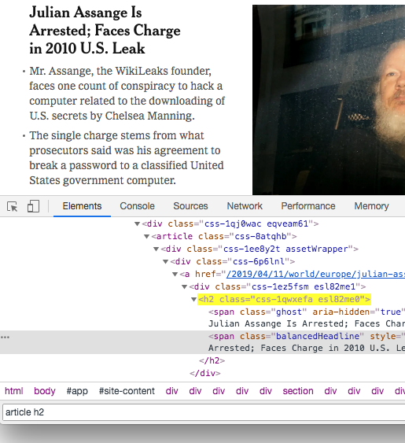
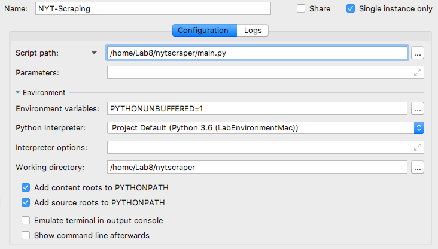
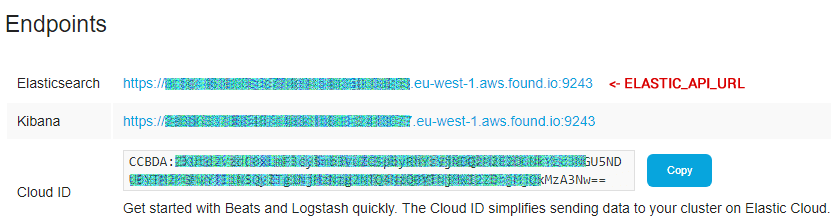

# Lab session 7: Using the Elastic Stack to study scraped data from a web page

[Scrapy](https://scrapy.org/) is a Python framework for large-scale web scraping. It provides all the tools needed to extract data from websites efficiently, processes them as required, and [store them in the most suitable structure and format](https://doc.scrapy.org/en/latest/topics/feed-exports.html).

The Elastic Stack is composed of several open source projects: Elasticsearch, Kibana, Beats, and Logstash. They all work together and help people around the world do great things with their data. From stock quotes to Twitter streams, Apache logs to WordPress blogs, the products are extending what's possible with data, delivering on the promise that good things come from connecting the dots.

In this lab session you will learn how to extract data from webpages and then analyze it using the Elastic Stack to obtain some interesting insights.

* [Task 7.1: Extract selected information from a newspaper webpage](#Tasks71)
* [Task 7.2: Obtain a subset of the movie industry to do some research](#Tasks72)  
* [Task 7.3: Study the obtained data using the Elastic Stack](#Tasks73)  

<a name="Tasks71"/>

## Task 7.1: Extract selected information from a newspaper webpage

Learn more about Scrapy reading a detailed [Scrapy Tutorial](https://doc.scrapy.org/en/latest/intro/tutorial.html) and [Scrapy documentation](https://doc.scrapy.org/en/latest/).

### Scrapy installation

Scrapy can be installed using conda, pip or anaconda.

```bash
_$ pip install scrapy
```

### Scrapy shell

Once the Scrapy package is installed, you can use the Scrapy shell to do some testing before programming your web data extraction. In the following example, we download the home page of ["The New York Times"](https://www.nytimes.com/), take a look at the structure of the HTML and extract the title of the main articles and their authors. As you can see we can use a CSS syntax to select the HTML elements of the page.

```
fetch("https://www.nytimes.com/")
print(response.text)
response.css("article a h2::text").extract_first()
response.css("article a h2::text").extract()
response.css("article p::text").extract()
```

To find the "search path" you may want to use Google Chrome, find the URL, inspect the code and use the search bar at the botom of the code to match the path.

<p align="center"></p>


### Scrapy custom spyders

Once you have explored the page you can write a custom spyder to programatically extract data from HTML pages.

```
scrapy startproject nytscraper
```

The above command will create the following file structure in the current directory:


<p align="center"></p>

The most important components are the file `nytscraper/settings.py` containging the settings for the project and the directory `nytscraper/spiders/` that keeps all the custom spiders.

Now you can create a new spider by typing:

```bash
_$ cd nytscraper
_$ scrapy genspider nytimes www.nytimes.com
```

The execution creates a file named `nytscraper/spiders/nytimes.py` inside the project directory. The file contains a the following basic code:
```python
import scrapy


class NytimesSpider(scrapy.Spider):
    name = 'nytimes'
    allowed_domains = ['www.nytimes.com']
    start_urls = ['http://www.nytimes.com/']

    def parse(self, response):
        pass
```

Few things to note here:

- **name**: Name of the spider, in this case, it is “nytimes”. Naming spiders properly is essential when you have to maintain hundreds of spiders.
- **allowed_domains**: An optional list of strings containing domains that this spider is allowed to crawl. Requests for URLs not belonging to the domain names specified in this list won’t be followed.
- **parse(self, response)**: This function is called whenever the crawler successfully crawls a URL. Remember the response object from earlier?.

After every successful crawl the *parse(..)* method is called, and so that’s where you write your extraction logic. 

For our example, once we have carefully examined the HTML page, we decide that we want to extract the list of headlines from the homepage which appear under the HTML tag *section* of class *top-news*. We will use a lambda function to clean the text.

```python
import scrapy
import unidecode
import re

cleanString = lambda x: '' if x is None else unidecode.unidecode(re.sub(r'\s+',' ',x))

class NytimesSpider(scrapy.Spider):
    name = 'nytimes'
    allowed_domains = ['www.nytimes.com']
    start_urls = ['https://www.nytimes.com/']

    def parse(self, response):
        for section in response.css("section[data-testid]"):
            section_name = section.attrib['data-block-tracking-id']
            for article in section.css("article"):
                yield {
                    'section': section_name,
                    'appears_ulr': response.url,
                    'title': cleanString(article.css('a h2::text, a h2 span::text').extract_first()),
                    'article_url': response.url[:-1]+article.css('a::attr(href)').extract_first(),
                    'summary': cleanString(''.join(article.css('p::text, ul li::text').extract())),
                }
```

In the above code, every invocation of parse yields a JSON record containing something like the following example:

```json
{
    "section": "Editors Picks",
    "appears_ulr": "https://www.nytimes.com/",
    "title": "In Bubbles, She Sees a Mathematical Universe",
    "article_url": "https://www.nytimes.com/2019/04/08/science/uhlenbeck-bubbles-math-physics.html",
    "summary": "For Karen Uhlenbeck, winner of the Abel Prize for math, a whimsical phenomenon offers a window onto higher dimensions."
}
```

### Extract your results to a JSON file

To obtain the results of parsing the home page of the New York Times we can type at the command line below. We use the *name* of the parser and tell it to output the result to a file that will contain a list of JSON records.

```bash
scrapy crawl nytimes -o nytimes.json

```

To debug the code using PyCharm we can add a new file named `main.py`, at the same directory containing `scrapy.cnf`, that will contain the command line that we typed before. I strongly advise you to use this option to speed up the creation of your parsers.

<p align="center"></p>


```python
from scrapy import cmdline

cmdline.execute("scrapy crawl nytimes -o nytimes.json".split())
```
### Scrape the new found URLs

Using Scrapy, we could also add a new parser for the articles ULRs. The HTML structure of the article's pages will be different, and it is necessary to examine it to detect where is the information that we need to retrieve.

Our new parser will look like:

```python
...
class NytimesSpider(scrapy.Spider):
    name = 'nytimes'
    allowed_domains = ['www.nytimes.com']
    start_urls = ['https://www.nytimes.com/']

    def parse(self, response):
        for section in response.css("section[data-testid]"):
            section_name = section.attrib['data-block-tracking-id']
            for article in section.css("article"):
                article_url = response.url[:-1] + article.css('a::attr(href)').extract_first()
                yield {
                    'section': section_name,
                    'appears_ulr': response.url,
                    'title': cleanString(article.css('a h2::text, a h2 span::text').extract_first()),
                    'article_url': article_url,
                    'summary': cleanString(''.join(article.css('p::text, ul li::text').extract())),
                }
                next_page = article_url
                if next_page is not None:
                    yield response.follow(next_page, callback=self.parse_article)

    def parse_article(self, response):
        yield {
            'appears_ulr': response.url,
            'title': cleanString(response.css("h1[itemprop='headline'] span::text, h1[itemprop='headline']::text").extract_first()),
            'authors': cleanString(', '.join(response.css("p[itemprop='author creator'] a span[itemprop='name']::text").extract())),
            'contents': cleanString(''.join(response.css('section[itemprop=\'articleBody\'] p::text').extract())),
        }
```
Parsing the articles will produce records similar to the following one:

```json
{
    "appears_ulr": "https://www.nytimes.com/2019/04/09/nyregion/jane-doe-song-yang-flushing.html",
    "title": "'Jane Doe Ponytail': Her Life Ended in N.Y. Now Her Brother's Bringing Her Home.",
    "authors": "Dan Barry, Jeffrey E. Singer",
    "contents": "A long-limbed man carrying a black ..."
}
```
Prepare a new **private** repository in GitHub named `scrapy-lab` to commit all the changes to your code. Invite `angeltoribio-UPC-BCN` to your new remote private repository as a collaborator.


**Q71: Add the above code to your `scrapy-lab` repository. Add the `nytimes.json`, containing the output of your execution, to the Lab7 folder of your answers repository. (20% of total grade for this lab session)**

<a name="Tasks72"/>

## Task 7.2: Obtain a subset of the movie industry to do some research

IMDb, also known as [Internet Movie Database](https://www.imdb.com/), is an online database of information related to, amongst others, the world of films, including cast, production crew, personnel and fictional character biographies, etc. Most data in the database is provided by volunteer contributors. The site enables registered users to submit new material and edits to existing entries. 

We would like to use this vast database to study the relationship between actors regarding the movies they have been playing. Therefore you can begin scraping your favorite movie URL `https://www.imdb.com/title/tt0096463/fullcredits/`, extract the list of all the actors in that movie following the format below.

```json
{   "movie_id": "tt0096463", 
    "movie_name": "Working Girl", 
    "movie_year": 1988,
    "actor_name": "Kevin Spacey", 
    "actor_id": "nm0000228", 
    "role_name": "Bob Speck"
}
```

Once you have scraped that movie you can continue scraping the pages from each actor that you have found  `https://www.imdb.com/name/nm0000228/` to obtain more movies to scrape. You can also scrape `https://www.imdb.com/name/nm0000228/bio` to obtain some personal details such as birthdate, birth name or height.

That will easily create an extremely long listing that will take a lot of time collect the data. Therefore, let's concentrate on the movies that were filmed during the 80's: we will only fully scrape a new movie URL if the movie has been filmed on that period.

You can run the scraper for 3-4 minutes to extract some records as a test. Later, we will use the output of this process to feed the Elastic Stack for next task.

**Q72: Add the code of the new spider your `scrapy-lab` repository. Add the `imdb.json`, containing the output of your execution, to the Lab7 folder of your answers repository. (30% of total grade for this lab session)**

<a name="Tasks73"/>

## Task 7.3: Study the obtained data using the Elastic Stack

The [Elastic](https://www.elastic.co/) company was founded in 2012 in Amsterdam by the people behind Elasticsearch and Apache Lucene. This company distributes the above products and its documentation. They generate income offering support, consulting and training as well as offering a SaaS access to all their products. You can [request a 14 days trial](https://www.elastic.co/cloud) for the cloud version to analyze the data that you extracted during the previous task.

I advise you to concentrate on using the tool and later decide if you want to download and install the software for your future needs. 

### Elasticsearch

[Elasticsearch](https://en.wikipedia.org/wiki/Elasticsearch) is an open source NoSQL distributed and scalable search engine. Elasticsearch provides a distributed, multitenant-capable full-text search engine with an HTTP web interface and schema-free JSON documents.

It allows one to start with a single machine and scale to hundreds. It supports distributed search deployed over Amazon EC2's cloud hosting.

Elasticsearch, developed in Java, is released as open source under the terms of the Apache License. It can be used to index and search all kinds of text documents, providing scalable, near real-time queries supporting multi-tenancy. It uses [Apache Lucene](https://lucene.apache.org/core/) as the query language and tries to make all features of it available through the RESTful, JSON-based API.

The [installation of Elasticsearch](https://www.elastic.co/guide/en/elasticsearch/reference/current/zip-targz.html) is quite simple following the provided documentation. 

### Kibana

[Kibana](https://en.wikipedia.org/wiki/Kibana) is an open source data exploration and visualization tool built on Elasticsearch to help you understand data better. It provides visualization capabilities on top of the content indexed on an Elasticsearch cluster. Users can create bar, line and scatter plots, or pie charts and maps on top of large volumes of data.

Kibana allows you to natively interact with all your data in Elasticsearch via custom dashboards. Kibana’s dynamic dashboard panels are savable, shareable and exportable, displaying changes to queries into Elasticsearch in real-time. 

You can perform data analysis on Kibana’s beautiful user interface using pre-designed dashboards or update these dashboards in real-time for on-the-fly data analysis.

The [installation and initialization of Kibana](https://www.elastic.co/guide/en/kibana/current/install.html) are similar to the one for Elasticsearch.
Kibana is available for Linux and Darwin (macOS) as a .tar.gz package. Choose the correct version according to your operating system.

### Request your Elastic Stack cloud trial

Go to the [cloud version of the Elastic Stack](https://www.elastic.co/cloud), enter your email and ask for the 14-day trial period. It is better to do this once you have your scraping process running correctly.

You can read the following [documentation](https://www.elastic.co/guide/en/cloud/current/getting-started.html) for further details.

### Insert data in Elasticsearch

Once you will have your credentials, you will have two different URLs: Elasticsearch and Kibana.

<p align="center"></p>

You can use the Python [elasticsearch package](https://elasticsearch-py.readthedocs.io) to insert one record or many. The following code inserts one record at an "index" named 'imdb' that you will be able to recover from Kibana.

```python
from elasticsearch import Elasticsearch

ELASTIC_API_URL_HOST = os.environ['ELASTIC_API_URL_HOST']
ELASTIC_API_URL_PORT = os.environ['ELASTIC_API_URL_PORT']
ELASTIC_API_USERNAME = os.environ['ELASTIC_API_USERNAME']
ELASTIC_API_PASSWORD = os.environ['ELASTIC_API_PASSWORD']

es=Elasticsearch(host=ELASTIC_API_URL_HOST,
                 scheme='https',
                 port=ELASTIC_API_URL_PORT,
                 http_auth=(ELASTIC_API_USERNAME,ELASTIC_API_PASSWORD))
```


Going to the code from the above task you can replace:

```python
yield {
    "movie_id": "tt0096463",
    "movie_name": "Working Girl",
    "movie_year": 1988,
    "actor_name": "Kevin Spacey",
    "actor_id": "nm0000228",
    "role_name": "Bob Speck"
}
```

by a call to the `ElasticSearch` package to insert the record in Elasticsearch.

```python
es.index(index='imdb',
         doc_type='movies',
         id=uiid.uiid4(),
         body={
            "movie_id": "tt0096463",
            "movie_name": "Working Girl",
            "movie_year": 1988,
            "actor_name": "Kevin Spacey",
            "actor_id": "nm0000228",
            "role_name": "Bob Speck"
        })
```

### Explore the data in Kibana

Connect to the Kibana URL with your browser. Select the "imdb" index and see that while you are running your program more records are being added. Once you have more than 5000 records explore the visualization option and create:

- A tag cloud showing who are the most popular actors for the period. A new record is inserted every time that an actor participates in a movie, therefore, you can count how many records exist for each actor.

- A bar diagram showing how many actors employ each movie. Take the 50 movies with more actors for the period.

- A bard diagram showing the filming activity for each year (plot the total count of records per year).

Save each of the above plots with a name and add them all to a Kibana Dashboard. See that if you select any element of any plot a filter is created automatically and all the plots change immediately.


**Q73: Take a screenshot of the Kibana Dashboard showing the above plots without filters. Set a couple of filters, take screetshots. Add all the screenshots to the Lab7 folder of your answers repository. (20% of total grade for this lab session)**

### What is your question?

Now that you know how all the system works you may want to think of changing a bit the information retrieved and formulate one question that you want to answer using the overall system deployed. That could be, think of your own question, "what is the average height of the top then actors more popular for the time period studied?".

Change the code according to your question, create a new view and add it to the Dashboard. Take a screenshot of the new plot.

**Q74: Explain what you have done in the README.md file of the Lab7 folder of your answers repository, add the new plot. Push the code changes to your `scrapy-lab` repository (30% of total grade for this lab session)**


**Q75: How long have you been working on this session? What have been the main difficulties you have faced and how have you solved them?** Add your answers to `Lab7/README.md` of your Lab answers repository.

# How to submit this assignment:

Create a **new and private** repo named *https://github.com/YOUR-ACCOUNT-NAME/CLOUD-COMPUTING-CLASS-2020-Lab7* and invite your Lab. session partner and `angeltoribio-UPC-BCN`.

It needs to have, at least, two files `README.md` with your responses to the above questions and `authors.json` with both members email addresses:

```json5
{
  "authors": [
    "FIRSTNAME1.LASTNAME1@est.fib.upc.edu",
    "FIRSTNAME2.LASTNAME2@est.fib.upc.edu"
  ]
}
```

Go to your **private** `scrapy-lab` repository and commit the changes that you have made.

Make sure that you have updated your local GitHub repository (using the `git`commands `add`, `commit` and `push`) with all the files generated during this session. 

**Before the deadline**, all team members shall push their responses to their private **CLOUD-COMPUTING-CLASS-2020-Lab7** repository.