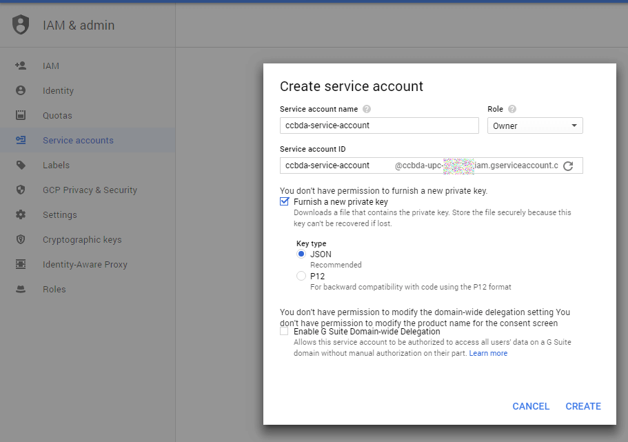

# Lab session #8: Advanced Analytics as a Service in the Cloud

In this Lab session, we are going to experiment the power of the Cloud Vision API from Google to detect text within images as an example of Advanced Analytics as a Service in the Cloud.

This section follows the official [introduction to image classification]( https://cloud.google.com/vision/docs/detecting-labels).

This hands-on helps you to classify images using labels. [Cloud Vision API](https://cloud.google.com/vision/) enables developers to understand the content of an image by encapsulating powerful machine learning models in an easy to use REST API. It quickly classifies images into thousands of categories (e.g., "sailboat", "lion", "Eiffel Tower"), detects individual objects and faces within images and finds and reads printed words contained within images. You can build metadata on your image catalog, moderate offensive content, or enable new marketing scenarios through image sentiment analysis. Analyze images uploaded in the request or integrate with your image storage on Google Cloud Storage. Try the API [(Drag image file here or Browse from your computer)](https://cloud.google.com/vision/). Locate the area shown below and test the functionality offered:

<p align="center"></p>

<a name="Tasks81"/>

## Task 8.1:  Google Cloud Vision


### 8.3.1 Cloud Platform sign up
It exists a free trial for this service, to fully enjoy the benefits of Google’s Cloud platform the best option is to get a business trial, with $300 worth of free credit for this year. That amount is far more than enough for the expected needs on this subject’s scope and will give you time enough to explore other features.

You need to have a google account, in case you don't have one, please, register.
Once the registration process is finished, follow this [quick start guide]( https://cloud.google.com/vision/docs/quickstart) where you will be able to create and setup the necessary resources to execute a demo using your web browser. It is necessary to enable billing for this project to continue, but as long as we are spending from the free credit we have there is nothing to worry about.

The project creation process takes a few seconds, after finishing it will appear in our list. It is time to select the new project and enable the Cloud Vision API that is the tool we will use during this hands-on. Finally, we need to set up some credentials that will be the way we authenticate to enable the communication: This can be done selecting “Credentials” in the left menu and simply clicking over the blue button saying “Create credentials” and choosing the “service account key” option.  Select JSON as your key type. Once completed, your service account key is downloaded to your browser's default location.

### 8.3.2 Python environment setup

Let's now execute access the service using a program. The scripts and demo files needed can be downloaded from the official Google Cloud Platform GitHub repository, and only a few more changes will be needed to be ready.

#### Download the Example Code
Download the code from this repository. You can do this by executing:

```bash
_$ git clone https://github.com/CCBDA-UPC/google-cloud-vision-example.git cloud-vision
```

This will download the repository of samples into the directory
`cloud-vision`.

This example has been tested with Python 2.7 and 3.4.

#### Set Up to Authenticate With Your Project's Credentials

Next, set up to authenticate with the Cloud Vision API using your project's
service account credentials.

<p align="center"></p>

E.g., to authenticate locally, set the `GOOGLE_APPLICATION_CREDENTIALS` environment variable to point to your
downloaded service account credentials before running this example:

```export GOOGLE_APPLICATION_CREDENTIALS=/path/to/your/credentials-key.json```

If you do not do this, you will see an error that looks like this when
you run the script:

```
oauth2client.client.ApplicationDefaultCredentialsError: The Application Default Credentials are not available. They are available if running in Google Compute Engine. Otherwise, the environment variable GOOGLE_APPLICATION_CREDENTIALS must be defined pointing to a file defining the credentials. See https://developers.google.com/accounts/docs/application-default-credentials for more information.
```


### 8.3.3 Quick Start: Running the Example

<p align="center"></p>


If you'd like to get the example up and running before we dive into the
details, here are the steps to analyze the image of this [tweet](https://twitter.com/angeltoribio/status/963048129569443841).

1. Enable your virtualenv and go to the repository folder:
```bash
$ source <path-to-virtualenv>/bin/activate
$ cd google-cloud-vision-example
```

2. Install the requirements:
```bash
$ pip install -r requirements.txt
```

2. Run the `label.py` passing the downloaded tweet image as argument:
```bash
$ python label.py <path-to-image>
```

3. Wait for the script to finish. It will show 5 possible classfications for your image:
```bash
Results for image Marenostrum.jpg:
technology - 0.929
computer network - 0.857
electronic device - 0.820
metropolitan area - 0.748
server - 0.723
```

### 8.3.4 Classify images

Now that you know how to use the Google cloud vision service what about analyzing the pictures posted on Twitter by famous people? You can, instead, scrape a website and analyze the pictures published there.

Create a file `ImageAnalyzer.py` that you will run on your computer. The first command line parameter will be the URL of a website or valid or Twitter profile. That program will:

1. obtain the last 100 images from the URL entered
2. send the images to Google Cloud Vision
3. store all the tags describing the images and the associated probabilities
4. create a PNG file containing a histogram, or any other type of representation, of what thinks Google cloud vision about the images published by that profile

**Q81: What problems have you found developing this section? How did you solve them?** Attach to your Lab08 folder the README.md file containing your answers, the code and some histograms, related to different analyzed profiles.

**Q82: How long have you been working on this session? What have been the main difficulties you have faced and how have you solved them?** Add your answers to `README.md`.

# How to submit this assignment:

Create a **new and private** repo named *https://github.com/YOUR-ACCOUNT-NAME/CLOUD-COMPUTING-CLASS-2020-Lab8* and invite your Lab. session partner and `angeltoribio-UPC-BCN`.

It needs to have, at least, two files `README.md` with your responses to the above questions and `authors.json` with both members email addresses:

```json5
{
  "authors": [
    "FIRSTNAME1.LASTNAME1@est.fib.upc.edu",
    "FIRSTNAME2.LASTNAME2@est.fib.upc.edu"
  ]
}
```

Include the code and histograms for task 8.1

Make sure that you have updated your local GitHub repository (using the `git`commands `add`, `commit` and `push`) with all the files generated during this session. 

**Before the deadline**, all team members shall push their responses to their private **CLOUD-COMPUTING-CLASS-2020-Lab8** repository.

