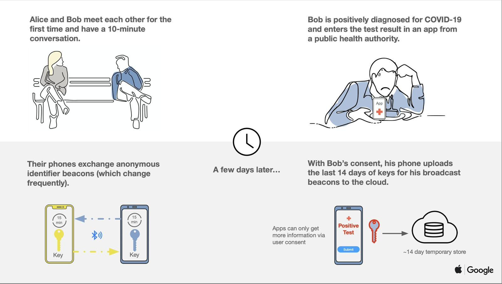
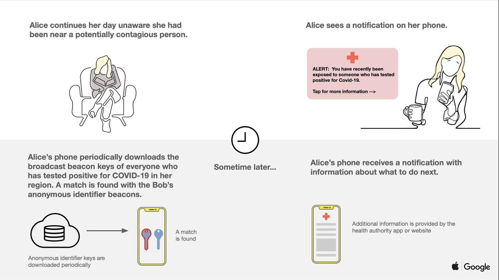

# Cloud Computing for Big Data Analytics practical jobs

>Tell me and I forget. Teach me, and I remember. Involve me, and I learn.
>
>Benjamin Franklin

In Cloud Computing for Big Data Analytics, there will be two sorts of student jobs: lab assignments and one project. Some lab sessions include pre-session homework.

Students are expected to complete and submit the assigned pre-lab homework before each lab session.

## Lab assignments
Students will begin by creating an essential toolbox to get them started in the Cloud. It will prepare them to be able to practice with APIs, the doors in the Cloud. That will also allow students to be able to mine the deluge of data coming from the Cloud or using new advanced analytics services available nowadays in the Cloud. Finally, we will look under the hood of these high-level analytics services in the Cloud, either regarding software or hardware, to understand how to meet high-performance requirements. The final goal is to provide code examples that smoothly can get the student started.

- Lab 1: [Basic "Knowledge Toolbox" to get started in the Cloud][Lab1] 
- Lab 2: [Doors in the Cloud][Lab2]                                        
- Lab 3: [Extracting and Analyzing data from the Cloud][Lab3]              
- Lab 4: [Creating a web application using cloud PaaS][Lab4]          
- Lab 5: [Enhancing your web app using additional cloud services][Lab5]   
- Lab 6: [Programming your cloud infrastructure][Lab6]
- Lab 7: [Using the Elastic Stack to study scraped data from a web page][Lab7]    
- Lab 8: [Advanced Analytics as a Service in the Cloud][Lab8]
- Lab 9: [Interacting with users and services in the Cloud][Lab10]      

[Lab1]: ./Lab01.md
[Lab2]: ./Lab02.md
[Lab3]: ./Lab03.md
[Lab4]: ./Lab04.md
[Lab5]: ./Lab05.md
[Lab6]: ./Lab06.md
[Lab7]: ./Lab07.md
[Lab8]: ./Lab08.md
[Lab10]: ./Lab10.md

#### Deadlines

The deadlines for each assignment will be published at the "FIB Racó".

#### Acknowledgements
I would like to thank Prof. Jordi Torres for developing the initial version of these lab sessions and thanks also due to some of his former students for their help proofreading and improving the documentation: Eloy Gil, Dani Cea, Xisco Sastre, Maurici Yagüez and Mauro Gómez.

## Course Project
The course project will be completed in teams of **five students enrolled in the same sub-group**.  Before starting the development, students require the teacher's approval of their course project proposal.

The student project is meant to allow students to put into practice many concepts that they learn in this subject. It is an exercise to help students to consolidate their learning, not a way to obtain a flawlessly working prototype.

Students are supposed to invest forty hours of their time (two hundred hours the five members). If the group is too ambitious in the scope of the project, there is a high chance of running out of time.

A good approach is to work on a simple idea that makes sense by itself. Once it is working, make it grow larger by adding new features. Students may end up having all the initially planned tasks or not.

It is much better to present a well defined, correctly executed but partially working idea than a very sophisticated working program that nobody will dare to touch a line of code after three weeks because of the high probability of making a huge mess.

For the project, students need to **create a web app, web service or set of microservices that will be available on the AWS cloud**.

Bear in mind when you build your architecture:

- design it for failure: avoid single points of failure
- keep information and the whole infrastructure secure
- implement elasticity
- have components decoupled 
- optimize it for performance

### Project challenge

Based on the ideas explained in [this article](https://www.sciencedirect.com/science/article/pii/S0198971514001367), create a simplified model of people behavior and infection spread.

Your model needs to work with, at least, the following parameters:

- infection status: susceptible, infected, infectious, treated and cured.

- **duration** of the **incubation stage**, the **symptomatic stage** and the duration to fight the infection and **become immune**. **Mortality percentage** for the infected individuals. These parameters will be **entered by the simulation user**.

- individuals are be characterized as students, workers, stay-at-home or elderly. 

- daily agenda for an individual is subject to daily activity patterns, depending on the classification of this individual (see Table 4. Activity patterns)

- to propagate the infection the model will use the **mean number of transmission events per hour** of contact between fully infectious and fully susceptible people. This parameter will be **entered by the simulation user**.

Build a prototype of the [functionality proposed by Google and Apple]( 
https://www.theverge.com/2020/4/10/21216484/google-apple-coronavirus-contract-tracing-bluetooth-location-tracking-data-app). 

Your simulator will add a phone to every individual that will be storing the beacons exchanged by the people who have been interacting with the phone owner.

Reproduce the functionality explained in the following illustrations.

You only need to simulate the the phones reading and writing the anonymous identifier beacons of the interactions before the infection is detected. 

People notified to have been in contact with an infected individual, will immediately be isolated at home (change their daily agenda to "H") for a **period of time** defined by the user or until they become cured (change their daily agenda to "M") if they develop the infection.

Create a graphical interface that demonstrates how does your simulation tool works and how effective is the use of the Google & Apple project. Students are invited to use [Elastic tools](https://www.elastic.co/) for that purpose.

- Elastic offers a great data storage for geo-based information. You can manage geo_point and geo_shape to model all kind of interactions and query conditions: https://www.elastic.co/guide/en/elasticsearch/reference/current/geo-queries.html

- Elastic Maps Services provide tiles for geo maps as well as vectorized maps for countries, provinces, regions, etc. You can leverage those, for example, to render administrative region dimensions https://maps.elastic.co/#file/world_countries

- To visualize information in Elastic Kibana, Elastic Kibana Lens added recently, is a great feature to design your visualizations. Just drag and drop fields and tune your charts: https://www.elastic.co/what-is/kibana-lens

- In the Machine Learning module, available in Elastic Cloud service, you can find regression, binary classification and outlier detections. Find some examples of how to use those analyses with the sample datasets you can find in Kibana: https://www.elastic.co/guide/en/machine-learning/7.6/dfanalytics-examples.html

The system must be parametrized and built to simulate any number of individuals and interactions between them. 

#### Additional resources

- https://www.hpcwire.com/2020/04/07/spanish-researchers-introduce-hpc-ready-covid-19-spread-simulator/

- https://www.academia.edu/16795162/EpiGraph_A_Scalable_Simulation_Tool_for_Epidemiological_Studies

- http://www.gleamviz.org/simulator/

- https://towardsdatascience.com/simulating-epidemics-using-go-and-python-101557991b20

### Project requirements

- The code of the project will be written in **Python 3**. Additional programming languages for **small parts of the project** can also be used  (i.e., JavaScript, ...)

- Students can use as many cloud services, packages or open source code as they need, They only need to explain the reasons for using these resources.

- Create a private **GitHub** repository to manage the code versioning. All team members and angeltoribio-UPC-BCN need to have access to it.

- Follow the twelve-factor methodology as much as possible. A clear and concise explanation on how the project benefits from each of the factors used. Justification for not using any of the  factors  (time constraints or project scope are examples of valid reasons) and how having used them could have affected the project.

- Students team need to have an **always working demo** showing the advances that they have achieved up to the moment. Obviously, some functionality will be partially working or not working at all that will not be available at the exposed demo.

- The demo does not need to be up 24/7, but students need to be able to have a running demo in less than five minutes. For that purpose, students are ecouraged to automate their deployments as much as possible.

- Use log files/streams extensively to provide a trace of the programs, good or bad, functioning.

### Project first draft

On a normal project, one would have a series of draft documents before delivering the final report. In this case, students will only to have to produce two documents: what the team plans on doing (first draft) and what they finally did (final report).

Student teams need to provide:
 
 - a description of the functionality and scope of their project;  
 
- a listing of the resources and services required to build their solution;

- a listing the intended use of the 160 hours for all the main tasks of the project (i.e., architectural design, research and documentation on services and resources, coding, meetings, written documentation,  etc).

Students can create some proof of concept while developing the initial idea. However, it is required to have it validated by your teacher before they begin to build the project.

### Project final presentation

One of the goals of the practical assignments is to cooperate and share the knowledge with student peers, helping each other to be able to have a broader understanding of Cloud Computing and Big Data Analytics.

By the end of the project, students are encouraged to select and present the best from their work to help other class peers to take advantage of what the team has learned by doing the project.

Each team will have **ten minutes** for the public delivery of the project presentation.

### Project final report

The final report needs to contain a clear and concise explanation of the following points:

- What does the project finally do? 

- What are the differences in scope from the project first draft?: added and unimplemented features.

- How does the code do the above? Description and architectural diagram of the different parts.

- Discussion on the use of the twelve-factor methodology as stated in the requirements.

- Description of the methodology used to create the project: division of responsibilities, meetings organization, exchange of ideas and documentation,  created working environments (development, production, staging), tools used, etc.

- Description of the main problems encountered and the solutions implemented regarding coding, team organization, services, and resources used.

- For each of the services and resources used, explanation on how  project benefits from them. Giving some alternatives to obtain similar results and briefly explaining why have been discarded.

- Listing the hours invested, by each member, for all the main tasks of the project (i.e., architectural design, research and documentation on services and resources, coding, meetings, written documentation,  etc). What is the project deviation in hours. How could the team have deviated less from the initial hour count breakdown?

### Project deliverables

Students need to submit to "FIB Raco":

- for the project first draft: 
A **PDF file** containing an extended description of the scope of the project and a detailed tentative content index of the final report. 
Between 1000 and  2000 English words, adding any images considered necessary.

- for the final report and presentation:
    - a **PDF file** with the slides for in-class presentation;
    - a **PDF file** with the final report. 
Between 6000 and  10000 English words, adding any images considered necessary;
    - the GitHub URL containing the code repository.

#### Deadlines

The deadlines for each deliverable will be published at the "FIB Racó".
  

### Evaluation criteria

Delivered documents need to **follow the specified  restrictions in order to be graded**. Do not provide deliverables after the deadline, longer/shorter documentation or different file formats.

The project will be evaluated based on the **quality of the materials delivered** and the **compliance with the requirements**. The evaluation will pay specific attention to:

- the architectural design (modularity, reusability, portability, clarity in the definition of interfaces);

- the code (modular, adequately grouped in files, clear to understand);

- the methodology used to develop the project  (briefly explained in the final report);

- *clear and concise* documentation covering all the required topics;

- an effective in-class presentation that will allow student peers to enrich from the lessons learned by the team while doing the project.

Once the laboratory laboratory assignments have finished, students are required to continue attending to class. They will then have the opportunity to ask the teacher any doubts, have him to help solving problems, agree on changes in the scope of the project. The teacher will also be able to supervise that everyone is participating adequately and encourage students to improve any aspect of the project development (work methodology, details definition, etc.).

All team members need to demonstrate that they have equally contributed to the success of the project, therefore they need to communicate their efforts and difficulties to the teacher (during the in-class meetings and the technical interviews).

Based on the quality of the in-class presentation and the answers given during the in-class meetings and technical interview, **all team members may not end up having the same final grade** on the project.

